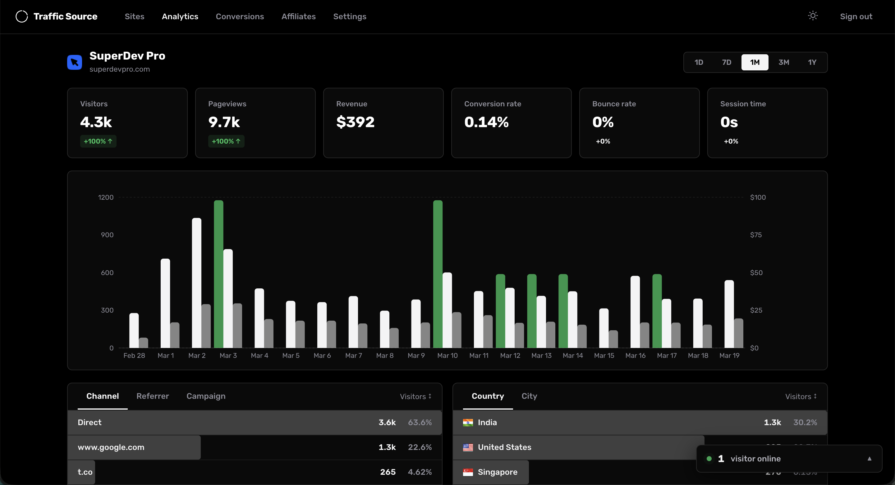

# Traffic Source

Open-source, self-hosted web analytics with conversion tracking and affiliate management. Deploy on a $4 VPS, own your data forever.

**No monthly fees. No data sharing. No limits.**



## Features

- **Real-time Analytics** — Live visitor count, pageviews, sessions, bounce rate, and session duration
- **Traffic Sources** — Referrers, UTM parameters (source, medium, campaign, term, content)
- **Geo Tracking** — Country and city-level visitor data via Cloudflare proxy headers
- **Device & Browser** — Browser, OS, device type, and screen resolution breakdowns
- **Conversion Tracking** — Stripe integration that auto-syncs payments every 60 seconds — no webhooks needed
- **Affiliate System** — Create affiliates with custom commission rates, shareable referral links, and public dashboards
- **Visitor Journeys** — Full session replay showing every page a visitor viewed before converting
- **Multi-site** — Track multiple websites from a single dashboard
- **Lightweight Script** — ~3KB tracking snippet with SPA support (pushState/popstate)
- **Privacy-first** — No cookies for tracking, all data stays on your server
- **SQLite** — Zero-config database, no external services needed

## Tech Stack

- **Framework:** Next.js 16 + React 19
- **Database:** SQLite (better-sqlite3) with WAL mode
- **Payments:** Stripe API (polling-based, no webhooks)
- **Auth:** JWT with httpOnly cookies
- **Styling:** SASS
- **Charts:** Recharts

## Quick Start

### Prerequisites

- Node.js 20+
- A VPS ($4/mo on Hetzner or $6/mo on DigitalOcean works great)
- Cloudflare account (free tier) for geo data + CDN

### 1. Clone and install

```bash
git clone https://github.com/your-username/traffic-source.git
cd traffic-source
npm install
```

### 2. Configure environment

```bash
cp .env.local .env.production
```

Edit `.env.production`:

```env
JWT_SECRET=your-random-64-char-hex-string
JWT_EXPIRY=7d
NEXT_PUBLIC_APP_URL=https://your-domain.com
DATABASE_PATH=./data/analytics.db
```

Generate a secure JWT secret:

```bash
openssl rand -hex 32
```

### 3. Build and run

```bash
npm run build
npm start
```

The app runs on port 3000 by default.

### 4. Set up Cloudflare proxy

1. Add your domain to Cloudflare (free plan)
2. Point DNS A record to your VPS IP
3. Enable the orange cloud (proxy) toggle
4. Done — Cloudflare will now send `cf-ipcountry` and `cf-ipcity` headers automatically

### 5. First login

Visit your domain and register. Only the first user can register — after that, registration is disabled.

## Production Deployment (VPS)

### Using PM2 (recommended)

```bash
# Install PM2 globally
npm install -g pm2

# Start the app
pm2 start npm --name "trafficsource" -- start

# Auto-restart on reboot
pm2 startup
pm2 save
```

### Zero-downtime deploys

The included deploy script pulls latest changes, builds in a temp directory, swaps atomically, and restarts PM2:

```bash
npm run deploy
```

### Nginx reverse proxy

```nginx
server {
    listen 80;
    server_name your-domain.com;

    location / {
        proxy_pass http://localhost:3000;
        proxy_http_version 1.1;
        proxy_set_header Upgrade $http_upgrade;
        proxy_set_header Connection 'upgrade';
        proxy_set_header Host $host;
        proxy_set_header X-Real-IP $remote_addr;
        proxy_set_header X-Forwarded-For $proxy_forwarded_for;
        proxy_set_header X-Forwarded-Proto $scheme;
        proxy_cache_bypass $http_upgrade;
    }
}
```

Since Cloudflare handles SSL, you can use Cloudflare's Origin CA certificate or Full (Strict) mode.

## Adding the Tracking Script

After creating a site in the dashboard, add this to your website's `<head>`:

```html
<script defer src="https://your-domain.com/t.js" data-site="YOUR_SITE_ID"></script>
```

That's it. The script automatically tracks:
- Pageviews (including SPA navigation)
- Referrers and UTM parameters
- Screen dimensions
- Affiliate referrals (`?ref=affiliate-slug`)

## Stripe Conversion Tracking

1. Go to your site's Settings and add your Stripe Secret Key
2. When creating Stripe Checkout Sessions in your app, pass the visitor tracking IDs:

```javascript
const session = await stripe.checkout.sessions.create({
  // ...your checkout config
  metadata: {
    ts_visitor_id: window.__ts.vid,
    ts_session_id: window.__ts.sid(),
  },
});
```

Traffic Source polls Stripe every 60 seconds and automatically matches payments to visitor sessions — no webhook setup required.

## Affiliate System

1. Go to your site's Affiliates page
2. Create an affiliate with a name, slug, and commission rate
3. Share their referral link: `https://your-site.com?ref=affiliate-slug`
4. Affiliates can view their own public dashboard via a share link

When a visitor arrives via a referral link and later converts, the affiliate is automatically credited.

## Environment Variables

| Variable | Required | Default | Description |
|----------|----------|---------|-------------|
| `JWT_SECRET` | Yes | — | Random hex string for signing auth tokens |
| `JWT_EXPIRY` | No | `7d` | Auth token expiry duration |
| `NEXT_PUBLIC_APP_URL` | Yes | — | Public URL of your Traffic Source instance |
| `DATABASE_PATH` | No | `./data/analytics.db` | Path to SQLite database file |
| `CRON_SECRET` | No | — | Secret for protecting cron endpoints |

## Database

Traffic Source uses SQLite with WAL mode — no external database to set up or maintain. The database file lives at `DATABASE_PATH` and includes automatic migrations.

**Backup your database:**

```bash
cp ./data/analytics.db ./data/analytics-backup-$(date +%Y%m%d).db
```

## Project Structure

```
├── public/
│   └── t.js                    # Tracking script (served to client sites)
├── scripts/
│   └── deploy.sh               # Zero-downtime deploy script
├── src/
│   ├── components/             # React components
│   ├── contexts/               # Auth, DateRange, Theme contexts
│   ├── hooks/                  # useAnalytics, custom hooks
│   ├── lib/
│   │   ├── db.js               # Database connection & migrations
│   │   ├── analytics.js        # Analytics query logic
│   │   ├── auth.js             # JWT & password helpers
│   │   ├── stripe-sync.js      # Stripe payment polling
│   │   └── withAuth.js         # Auth middleware for API routes
│   ├── pages/
│   │   ├── api/                # API routes (collect, auth, analytics, cron)
│   │   ├── analytics/          # Dashboard pages
│   │   └── sites/              # Site management
│   └── styles/                 # SASS stylesheets
├── data/                       # SQLite database directory
└── .env.local                  # Environment config
```

## License

MIT
